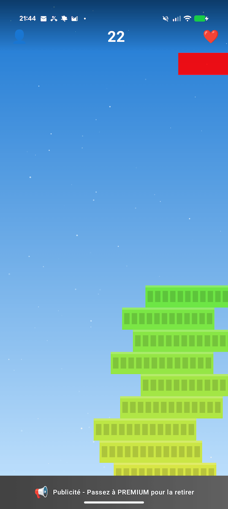

# Stack Game

A physics-based tower stacking game developed for Android using Kotlin and Jetpack Compose.

> [!NOTE]
> **Educational Purpose**: This project is primarily designed as a **Reverse Engineering target**. It serves as a practical subject for analyzing Android application security, obfuscation, api-spoofing and tampering techniques.
>
> **Associated Course Material**: [TP Sécurité Mobile](https://cours.brosseau.ovh/tp/securite/reverse.html)



- [Preview video](https://www.youtube-nocookie.com/embed/pnUSgpbpTJM?si=i5X-XwcC3a0f9Nbl)
- [Play store](https://play.google.com/store/apps/details?id=com.vbrosseau.stackgame)
- [APK direct download](./app-release.apk)


## Overview

Stack Game challenges players to build the highest tower possible by dropping blocks on top of each other. Unlike traditional implementations, this version incorporates 2D physics, including center-of-mass calculations, angular velocity, and stability checks.

The project is architected using MVVM (Model-View-ViewModel) and strictly separates game logic from rendering.

## Key Features

*   **Custom Physics Engine**: Deterministic logic for block stability, rotation, and tower balance.
*   **Procedural Difficulty**: Dynamic difficulty curve adjusting block width, speed, and alignment tolerance.
*   **Modern UI**: Fully declarative UI built with Jetpack Compose.
*   **User System**: tiered subscription simulations (Free, Premium, Ultra) handling ad overlays and game modifiers.
*   **Lives & Rewind**: Mechanics for lives management and game state restoration (snapshotting).

## Technical Stack

*   **Language**: Kotlin
*   **UI Framework**: Jetpack Compose
*   **Dependency Injection**: Koin
*   **Networking**: Ktor Client
*   **Architecture**: MVVM
*   **Build System**: Gradle Kotlin DSL

## Requirements

*   Android Studio Ladybug (or newer)
*   JDK 11
*   Android SDK 36 (compileSdk)
*   Min SDK 30

## Setup and Build

1.  Clone the repository:
    ```bash
    git clone git@github.com:c4software/StackGameApp.git
    ```
2.  Open the project in Android Studio.
3.  Sync Gradle files.
4.  Build and run the debug variant:
    ```bash
    ./gradlew assembleDebug
    ```

## Architecture

The project follows a strict unidirectional data flow:

*   **Domain**: Contains pure data models (`Block`, `User`, `GameSnapshot`).
*   **UI**: Composable functions that strictly render state provided by ViewModels.
*   **ViewModel**: Houses the game loop, physics calculations, and state management.

Dependencies are managed via `AppModule.kt` and injected using Koin.

## License

Copyright © 2025 Valentin Brosseau. All rights reserved.
